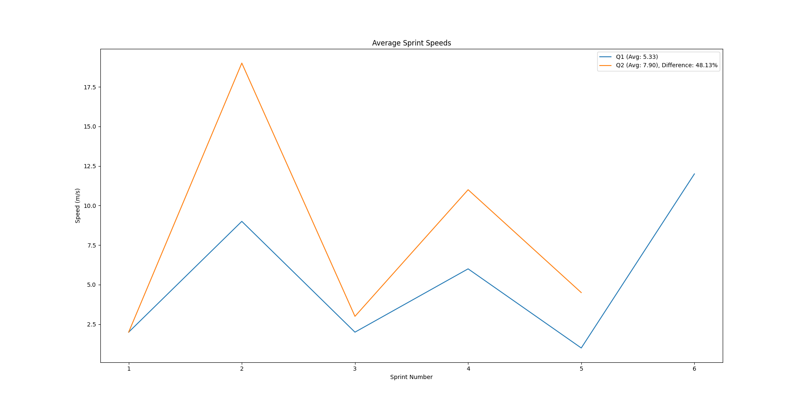

# Sprint Velocity Tracker 



`graph.py` is a Python script that generates a graph of quarterly data. It takes in quarterly data as command line arguments and outputs a graph of the data using the matplotlib library.

## Installation
Clone the repository to your local machine.
Install the required dependencies by running:

```
pip install -r requirements.txt`
```

## Usage
To use graph.py, run the following command:

```
python graph.py "Q1 data" "Q2 data" "Q3 data" "Q4 data"
```

Replace "Q1 data", "Q2 data", "Q3 data", and "Q4 data" with the quarterly data you want to graph. The data should be separated by commas and enclosed in quotes.

Each separated data by commas represents the sprint points done for each sprint within a quarter. For example, the following quarterly data:

```
 "2,9,2,6,1,12" "2,19,3,11,4.5,None" "3,8,4,9,2,10" "2,9,2,6,1,12"
```

represents four quarters, where each quarter has six sprints. The first quarter had sprint points of 2, 9, 2, 6, 1, and 12, respectively. The second quarter had sprint points of 2, 19, 3, 11, 4.5, and None (which represents an incomplete sprint), respectively. And so on for the third and fourth quarters.

The script will output a graph of the quarterly data using the `matplotlib` library.

## Contributing
If you would like to contribute to graph.py, please fork the repository and submit a pull request.

## License
`graph.py` is licensed under the MIT License. See LICENSE for more information.
